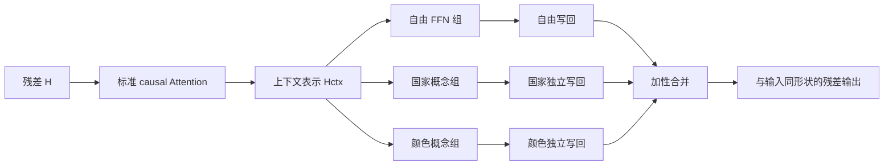

# Proposal：FFN 内的分组概念接口能否成为可审计的计算部件？

> 本文档既是研究方案，也是可直接交给 Codex 的独立任务书。执行者不应依赖此前对话。

## 0. 结论与评分

| 维度 | 当前评分 | 判断 |
|---|---:|---|
| 创新性 | **5.0/10** | 固定概念槽、概念监督和干预均有相近工作；“在 Transformer FFN 中按组保留概念地址，并以可拆分写回验证因果参与”有组合创新，但不是全新范式 |
| 应用价值 | **6.0/10** | 对概念体系明确、需要审计和干预的专业模型有价值；不适合作为通用大模型的默认替代结构 |
| 计算/可实现性 | **8.0/10（受控实验）** | 保留标准 Attention，不增加第二套 KV cache；若总 FFN 宽度固定，理论 MAC 基本不变 |
| 综合推荐 | **7.0/10（仅推荐先筛选）** | 推荐完成低成本、可证伪实验；在门槛通过前，不推荐大型语言建模或长时间服务器训练 |

**一句话决策：做，但先证伪，不梭哈。**

现有证据只有单 seed 的合成任务结果：

| 模型 | exact accuracy | 相对 Standard | 结论 |
|---|---:|---:|---|
| Standard | 70.495% | — | 基线 |
| FFN Concept Projector | 76.130% | +5.635pp | FFN 概念接口值得公平复核 |
| Concept Bus V2 | 64.860% | -5.635pp | 第二套概念 Attention 在当前设定中失败 |

这些结果来自 `RE3/output4`、仅一个 seed，不能作为论文结论，也不能证明下文的新结构有效。

---

## 1. 逻辑审核：原方案哪里有问题

| 原问题 | 为什么不成立或不严谨 | 本版修正 |
|---|---|---|
| 在 FFN 概念上再加 Attention | 上下文已由标准 causal self-attention 形成；第二套 Attention 增加优化竞争和成本，pilot 还显著降点 | 完全移除概念 Attention，保留原始 Attention |
| 定义了全局概念向量，却在写回时绕过它 | “可解释变量”若不处在真实前向路径上，只是 probe | 概念槽本身直接进入独立写回，并提供干预钩子 |
| 激活门和读取门并存 | 无跨 token 概念记忆时，额外读取门只是新的绕路和混淆源 | 一个激活值同时控制槽位存在性和写回强度 |
| 一面要求槽位表达 France/黄色，一面又把实体/颜色身份都算作泄漏 | 合法载荷与不允许的信息没有定义 | 每个槽只允许携带本概念及其子类；其他概念、模板和答案捷径才算泄漏 |
| 用可预测性代替忠实性 | 概念 F1 高不等于模型真正使用它；旧 CACB 甚至出现抑制后目标概率反向上升 | 同时做必要性、充分性、槽位置换和副作用测试 |
| 用验证 F1 触发不同训练阶段 | 不同模型得到不同训练轨迹，破坏公平性 | 所有模型使用预注册的固定训练步数和固定损失日程 |
| 直接声称最小互信息 | 连续确定性表示下难以可靠估计，且与保留合法子类载荷冲突 | 不声称精确互信息；用新训练的泄漏 probe 做审计，必要时再加独立 LeakGuard 消融 |
| 强制所有写回子空间严格正交 | 会占用残差容量、限制扩展，并可能再次牺牲性能 | 使用可拆分的加性写回；正交只作为可选消融，不作为主模型硬约束 |
| “可无限扩展概念” | 新概念必然消耗参数、数据和容量 | 明确区分预留槽和追加槽；扩展是低成本，不是零成本 |

因此，新的论文问题不再是“FFN Attention 是否有效”，而是：

> **在不改变标准上下文 Attention 的前提下，将一小部分 FFN 中间维度组织为有固定人类语义地址、可独立读写和干预的概念组，能否比普通投影获得更忠实的概念接口，同时保持任务性能？**

---

## 2. 核心故事

我们需要的不是一个“看起来可以解释”的 probe，而是一个真实参与计算的中间接口。

高层概念必须同时满足两点：

1. 它来自上下文，而不是词语的固有标签；“法国面包”中的国家属性需要结合整段语境形成。
2. 它位于 FFN 升维后的中间计算中，并在降维写回前可以被读取、修改、冻结和扩展。

标准 Attention 继续负责跨 token 形成上下文。FFN 不再是一整块不可区分的中间向量，而被划分为一个自由组和少量有名字的概念组。国家与颜色使用独立 sigmoid，不互相竞争；国家内部的 France/UK/China 和颜色内部的 red/blue/yellow 才各自在本组内竞争。

这里只从“总线”思想借用三条工程原则：固定地址、稠密读取已有上下文但只写少量命名通道、追加通道时零初始化。总线本身不会自动产生语义，语义仍来自标签、困难负例和干预训练；HC/xHC 一类多残差流也不是这里的新结构。

这仍然可以正常堆叠循环，因为模块输入和输出始终都是残差形状。

---

## 3. 最终候选结构：Grouped FFN Concept Interface（GFCI）

### 3.1 上下文与分组升维

标准 Attention 保持不变：

$$
H^{ctx}=H+\operatorname{CausalAttention}(\operatorname{Norm}(H))
$$

令：

$$
X=\operatorname{Norm}(H^{ctx})
$$

把 FFN 总宽度分为自由组和概念组：

$$
d_{free}+K d_g=d_{ff}
$$

$$
U_{free}=\phi(W_{up}^{free}X),\qquad
U_k=\phi(W_{up}^{k}X)
$$

其中 $$k=1,\ldots,K$$。概念身份由组索引固定，不再额外学习一个可能旋转或漂移的“地址向量”。

### 3.2 固定地址、动态载荷

每个概念组产生一个激活值和一个有界载荷：

$$
a_k=\sigma(w_k^\top U_k+b_k)
$$

$$
\delta_k=\rho a_k\tanh(U_{k,2:d_g})
$$

$$
c_k=\operatorname{concat}(a_k,\delta_k)\in\mathbb R^{d_g}
$$

这里：

- 槽位索引表示“这是国家槽”或“这是颜色槽”；
- $$a_k$$ 表示该高层概念是否被激活；
- $$\delta_k$$ 只允许表达本概念内部的子类和上下文载荷；
- 当 $$a_k$$ 接近零时，载荷和写回也一同接近零。

父概念相互独立：

$$
p(parent_k=1\mid X)=a_k
$$

子类只在本概念内归一化：

$$
p(child_k\mid X,parent_k=1)=\operatorname{softmax}(V_k c_k)
$$

国家与颜色不是同一个 softmax 中的竞争项。每个局部子类表必须区分：

- `none`：该父概念不适用；
- `unknown`：父概念存在，但子类不在已覆盖词表中。

### 3.3 可拆分写回

$$
\Delta H=D_{free}U_{free}+\sum_{k=1}^{K}D_kc_k
$$

$$
H^{out}=H^{ctx}+\Delta H
$$

写回是加性可拆分的，因此可以准确记录每个槽在接口处贡献了什么，也可以只替换某一个 $$c_k$$ 后重新运行后续网络。它保证的是**该接口处的结构化分解**，不保证后续层永远不再混合这些信息。

主模型不加入槽间 Attention、不加入第二套 KV cache，也不加入独立读取门。

### 3.4 扩展方式

| 方式 | 做法 | 成本与限制 |
|---|---|---|
| 预留槽 | 初始化时设置 $$K_{max}$$，未启用槽置零 | 扩展时结构不变，但预先占用 FFN 宽度 |
| 追加槽 | 冻结旧主干和旧槽，新增 $$W_{up}^k,w_k,D_k,V_k$$；解码器零初始化 | 每个槽增加参数与 MAC，需回放数据检查旧概念遗忘 |
| 纵向扩展 | 只扩展某个 $$V_k$$ 的子类行 | 成本最低；适合在“颜色”下增加新颜色 |

不能承诺新概念完全不影响旧概念。必须报告旧任务性能变化、旧槽漂移和新旧概念副作用。

---

## 4. 训练目标：少而明确

主实验只使用四类损失：

$$
\mathcal L=
\mathcal L_{task}
+\lambda_p\mathcal L_{parent}
+\lambda_c\mathcal L_{child}
+\lambda_{cf}\mathcal L_{cf}
$$

反事实损失必须来自只改变一个目标概念的配对样本。对样本对 $$x,x'$$ 和目标槽 $$k$$，将 $$x$$ 的槽位替换为 $$x'$$ 的槽位：

$$
\hat y_{do}=f\left(x;do(c_k(x)\leftarrow c_k(x'))\right)
$$

$$
\mathcal L_{cf}=
\operatorname{CE}(\hat y_{do},y')
+\lambda_{side}\sum_{j\ne k}
\operatorname{KL}(\hat p_j(x),\hat p_j^{do}(x))
$$

规则：

- 不使用损失相乘、相除、倒数或调和平均；这些形式不能保证公平使用各分支，反而容易产生尺度奇异和投机解。
- 损失权重只在 pilot 中确定一次，正式实验冻结。
- 阶段切换按固定步数，不按某模型的验证 F1 触发。
- 日志记录每项损失及其对共享参数的梯度范数、梯度余弦；若长期相差超过 10 倍，将其作为优化失败报告。
- `LeakGuard` 不是主模型默认部分。若结构通过主门槛，再单独测试梯度反转的禁止信息分类器；不得把它与结构收益混为一谈。

---

## 5. 什么叫“可审计”

必须区分三层证据：

| 层级 | 问题 | 指标 |
|---|---|---|
| 可读 | 能否从槽位识别人类标签？ | parent/child macro-F1、mAP、校准误差 |
| 参与 | 模型是否真的使用该槽？ | 置零必要性、仅保留充分性、task-loss 对槽参数的梯度 |
| 特异 | 修改一个槽是否只改变对应语义？ | 配对槽位置换成功率、非目标副作用、CACE/ICaCE 误差 |

合法与非法信息也要预注册：

| 槽位 | 允许的信息 | 禁止的信息 |
|---|---|---|
| COUNTRY | 国家是否存在、France/UK/China/unknown 等本地子类 | COLOR、模板 ID、干扰词、与概念无关的答案捷径 |
| COLOR | 颜色是否存在、red/blue/yellow/unknown 等本地子类 | COUNTRY、模板 ID、干扰词、与概念无关的答案捷径 |

泄漏 probe 必须在主模型冻结后重新初始化，只在训练表示上训练，并在未见测试表示上评估。不能用训练时的概念头同时充当审计器。

---

## 6. 最小而可信的实验

### 6.1 阶段 A：一 seed 合成筛选

使用改进后的 DualTag：国家和颜色可同时出现，提供 `none/unknown`，并生成只改变一个概念的严格配对反事实样本。

| 组 | 唯一变化 | 用途 |
|---|---|---|
| Standard | 普通 Transformer | 性能基线 |
| FFN-Projector | 复现 `output4` 的最佳简单接口 | 最强已有候选 |
| Residual-GFCI | 同一概念接口读取 $$H^{ctx}$$ | 检验 FFN 位置是否必要 |
| FFN-GFCI-Scalar | 每个概念只有 $$a_k$$ | 检验标量瓶颈 |
| FFN-GFCI-Vector | $$a_k$$ 加本组载荷 | 主候选 |
| FFN-GFCI-FreeMix | 写回前允许概念组稠密混合 | 检验固定分组是否真正有用 |

Scalar 版本仍保留与 Vector 相同的槽宽和参数，只令 $$c_k=a_ke_1$$，避免把“标量/向量差异”与参数量混在一起。FreeMix 使用概念组之间的可学习混合矩阵后再写回。Residual-GFCI 使用等宽适配器；从自由 FFN 宽度扣除等价预算，使“读取位置”尽量成为唯一变化。

所有组使用相同数据切分、tokenizer、位置编码、Attention、层数、隐藏维度、训练步数、优化器、学习率日程和验证频率。所有概念候选也必须使用相同的概念标签、损失权重、槽宽和干预协议。参数或 MAC 差异超过 1% 时，必须增加参数匹配 Standard，并同时报告参数和 MAC。

阶段 A 的自动进入门槛使用点估计，不把单 seed 当正式结论：至少一个 GFCI 相对 Projector 不低于 `-2pp`，parent macro-F1 不低于 `0.85`，槽位置换成功率不低于 `70%`，非目标副作用不高于 `10pp`，并且任务损失对概念槽存在稳定非零梯度。否则停止。

### 6.2 阶段 B：三 seed 合成复核

只有阶段 A 通过门槛才运行。使用 seeds `11、22、33`，保留：

1. Standard；
2. 参数匹配 Standard；
3. FFN-Projector；
4. 阶段 A 最佳 GFCI；
5. 最佳 GFCI + 随机打乱概念标签。

报告每个 seed，不用 $$n=3$$ 的脆弱显著性检验冒充强证据；主差异使用按测试样本分层、再跨 seed 汇总的 bootstrap 置信区间。

对胜出结构再做一个低成本顺序扩展测试：先训练 COUNTRY，冻结主干、旧槽和旧头，再添加 COLOR 槽。与 COUNTRY+COLOR 联合训练比较；报告新概念 F1、旧任务变化、旧槽输出漂移和额外参数/MAC。旧参数必须逐位不变，但这不等于旧行为必然不变。

### 6.3 阶段 C：CEBaB 真实数据

只有阶段 B 通过才运行。CEBaB 含 food、noise、ambiance、service 的人工反事实编辑，适合验证真实文本上的概念干预。比较 Standard、FFN-Projector、最佳 GFCI 和简单 Output-CBM，均使用三个 seed。

主指标：任务 macro-F1、概念 macro-F1、ICaCE/CACE 误差、槽位置换成功率、非目标副作用、参数、吞吐和峰值显存。

本轮论文先限定为**有概念监督的文本分类与因果审计**。不要在上述门槛通过前加入语言建模、DAG、跨 token 概念记忆或更多 Attention。

### 6.4 预注册门槛

最佳 GFCI 必须同时满足：

1. 相对 FFN-Projector 的任务性能 95% bootstrap CI 下界不低于 `-1.0pp`；
2. 合成集 parent macro-F1 不低于 `0.90`；
3. 配对槽位置换的目标成功率不低于 `80%`；
4. 非目标任务或非目标概念的绝对副作用不高于 `5pp`；
5. 置零目标槽造成方向正确的显著性能下降；
6. 真标签模型的因果对齐显著优于随机标签对照；
7. 三 seed 结论方向一致。

任一核心门槛失败，就停止扩大实验并报告否定结果，不继续堆正则项追点。

---

## 7. 复杂度

标准 FFN 每 token 的主要 MAC 近似为：

$$
\operatorname{MAC}_{FFN}\approx 2dd_{ff}
$$

当 GFCI 满足 $$d_{free}+Kd_g=d_{ff}$$ 时，分组升降维仍为：

$$
\operatorname{MAC}_{GFCI,core}\approx 2dd_{ff}
$$

额外成本主要是 $$K$$ 个小路由器和训练期概念头，约为：

$$
O(Kd_g)+O\left(\sum_k d_gn_k\right)
$$

因此它没有新增 $$O(T^2)$$ 项，也不增加自回归 KV cache。若在预留容量之外追加一个宽度为 $$d_g$$ 的概念组，则主要新增：

$$
\Delta P\approx 2dd_g
$$

$$
\Delta\operatorname{MAC/token}\approx 2dd_g
$$

例如 $$d=512,d_{ff}=2048,d_g=64$$ 时，一个额外槽约等于标准 FFN 成本的 `3.125%`；若概念槽本来就在固定总宽度内，则不产生这部分增量，只是重新分配容量。

计算评分高不代表一定更快：分组小矩阵可能降低 GPU kernel 利用率。必须以实测吞吐和峰值显存为准，并优先用一次大线性投影后切片实现，而不是循环调用大量小 Linear。

---

## 8. 新颖性边界与相关工作

文献边界检索截至 **2026-08-08**，优先引用论文或会议页面。投稿前仍需重新检索。

| 工作 | 已覆盖内容 | 本项目不能声称 |
|---|---|---|
| [CB-LLM](https://openreview.net/forum?id=pXx3nDi8hI) | 在语言模型中加入可解释概念瓶颈并做检测、生成控制 | 不能声称首次把概念瓶颈用于语言模型 |
| [Minimal Concept Bottleneck Models，ICLR 2026](https://openreview.net/forum?id=Fy7V5dalvX) | 指出“可预测”不等于“纯净”，显式限制概念外信息 | 不能声称首次发现概念泄漏问题 |
| [Sparse Concept Anchoring](https://arxiv.org/abs/2512.12469) | 把概念锚定到预定义方向或子空间，并支持干预 | 不能声称固定概念地址本身是全新的 |
| [Graph Memory Transformer](https://arxiv.org/abs/2604.23862) | 保留 causal Attention、用可检查图结构替换 FFN；可解释性增强但 PPL 落后 | 不能把“只改 FFN”当作首创；也必须正视性能代价 |
| [CEBaB](https://openreview.net/forum?id=3AbigH4s-ml) | 提供真实文本概念的人工反事实编辑和因果评估 | 不能只用自建合成集声称现实有效 |
| [Concept Flow Models](https://openreview.net/forum?id=TNYLf65I3I) | 使用层级概念结构缓解泄漏 | 不能把概念层级本身当作主要创新 |
| [CT-CBM](https://aclanthology.org/2025.findings-emnlp.106/) | 研究文本概念集合的完整性和扩展 | 不能把“可增加概念”当作首创 |
| [xHC](https://arxiv.org/abs/2607.14530) | 多残差流、稀疏写回和工程稳定性 | 这是残差流扩展，不等于本项目的 FFN 语义接口 |

本项目可能成立的新颖点只能谨慎表述为：

> 在保持标准 causal Attention 和固定 FFN 总预算的条件下，系统比较残差位置、普通 FFN 投影和固定分组 FFN 概念接口，并用独立加性写回、配对槽位置换和随机标签对照检验概念的真实计算参与。

这属于**结构组合 + 严格实证问题**。只有真实数据、三 seed、因果干预和非劣性能同时成立，创新性才可能上升到约 `6/10`；若仅在 DualTag 上提高概念 F1，创新性不超过 `4/10`。

---

## 9. 给 Codex 的执行任务书

### 9.1 工作区与保护规则

- 当前项目目录为 `RE3`。
- 先检查项目结构、README、依赖、测试、未提交修改和已有输出，再修改代码。
- 不删除或覆盖 `output4`、用户数据或无关文件。
- 数据只放 `data/`，checkpoint 只放 `ckpt/`，分析结果只放 `output/`。
- 不把 checkpoint、下载数据或大型逐样本激活写进 `output/`。
- 复用现有一键入口：`python main.py --size small|medium|large`。

### 9.2 必须实现

1. `GroupedFFNConceptInterface`：一次大升维后按组切片，避免大量小 kernel；支持 scalar/vector/free-mix/residual-tap。
2. `ConceptSlot`：独立 parent sigmoid、本地 child softmax、`none/unknown`、有界载荷。
3. `InterventionHook`：支持 zero、keep-only、swap、prototype replace，并能只修改指定槽。
4. 严格配对的 DualTag 2.0 生成器：记录 `pair_id`、改变的概念、原标签和反事实标签。
5. 冻结后新训练的 purity/leakage probes。
6. 参数量、近似 MAC、吞吐、显存和每项损失梯度统计。
7. 阶段门控和 `go_no_go.json`：未通过时自动停止后续昂贵阶段。
8. 多 GPU：多个独立 run 优先一 GPU 一进程并行；只有单个模型确实需要时才用 DDP。
9. CUDA 必须做真实张量运算预检；不可只依据 `torch.cuda.is_available()`。
10. checkpoint 目标间隔约两小时，始终保存 best 和 final，并支持累计训练时间恢复。

### 9.3 配置语义

| 命令 | 含义 |
|---|---|
| `python main.py --size small` | CPU/GPU smoke test；最小数据、约 200 步，只验证形状、梯度、因果性、干预和输出 |
| `python main.py --size medium` | 阶段 A；一个 seed，六模型受控筛选 |
| `python main.py --size large` | 从阶段 A 门槛开始，一键完成通过后的三 seed 合成复核和 CEBaB；失败则自动停止 |

seed 在 CFG 中使用数组；默认 `medium=[11]`，`large=[11,22,33]`。所有可消融项必须集中在 CFG，不允许散落硬编码。

`large` 可以复用配置哈希、代码指纹和数据指纹完全匹配的已完成阶段；任一指纹不一致必须重跑，不能混用旧结果。

### 9.4 必须通过的测试

- 输入输出 shape 与普通 FFN 完全兼容；
- task loss 对每个启用概念组的参数产生非零有限梯度；
- parent 关闭时 payload 和该组写回接近零；
- COUNTRY 和 COLOR 可以同时激活，且不通过同一个 softmax 竞争；
- swap COUNTRY 不会直接改写 COLOR 槽的张量；
- 改变未来 token 不得影响过去位置输出；
- 参数/MAC 统计与人工公式误差低于 2%；
- 新增概念并冻结旧模块后，旧参数逐位不变；
- checkpoint 恢复后 step、优化器、随机状态和累计时间连续；
- CPU smoke test、单 GPU 和多 GPU 调度均有测试；
- 测试不得依赖网络或大型下载。

### 9.5 输出规范

控制台保持单行、尽量不超过 140 字符。结构化日志字段位置固定：设备、阶段、模型、seed、step、loss、显存、间隔时间、累计时间；无值时保留占位。

`output/` 至少生成：

- `runs/.../metrics/final.json`；
- `conclusion/*.json`，文件名含阶段、模型和 seed；
- `summary.csv`；
- `go_no_go.json`；
- 参数/吞吐/显存比较表；
- 任务性能、概念质量、干预结果和副作用的 SVG 图；
- 一个无需服务器的静态 HTML/JS 汇总页。

### 9.6 完成定义

Codex 只有在以下事项全部完成后才能声明完成：

1. 代码、配置、README 和实验文档一致；
2. 所有测试通过，并报告实际测试数量；
3. `small` 在 CPU 上完整跑通；
4. `medium/large` 可被 dry-run 展开并验证所有 run 的控制变量；
5. 没有把旧 V2 结果误当作新 GFCI 证据；
6. 最终说明实现了什么、尚未证明什么、服务器应运行的唯一命令。

---

## 10. 最终判断

最可能成功的是：在标准 Attention 后，把 FFN 的少量中间容量变成可命名、可独立干预的并列概念组，并保持接近 Projector 的任务性能。

最可能失败的是：结构化槽位虽能预测标签，却仍被自由 FFN 绕过；或者硬分组降低了表示效率，最终用明显性能损失只换来很小的审计收益。

因此推荐顺序只有三个动作：

1. 先复现 FFN-Projector 的单 seed 优势；
2. 用同一套接口公平比较 Residual、Scalar GFCI 和 Vector GFCI；
3. 只有性能、因果特异性和随机标签对照同时过关，才运行 CEBaB 三 seed。

如果只能保留一个结构创新，应保留：**FFN 中固定概念分组 + 可拆分加性写回**。不要恢复第二套 Attention。
